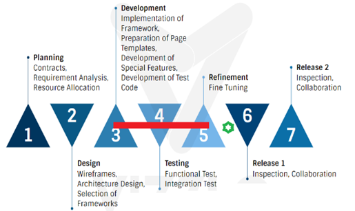

---

layout: col-sidebar
title: 方法論と背景
site_side: true
tags: security-qualitative-metrics, background, methodology
project: true
type: document
pitch: OWASP セキュリティ定性メトリクスはウェブプロジェクトのセキュリティレベルを評価するメトリクスの最も詳細なリストです。OWASP ASVS のカバレッジのレベルを示しています。
---

#  OWASP セキュリティ定性メトリクス

## 背景と環境の説明

セキュリティ定性メトリクスは関連する技術ドキュメントや文献の調査とドメイン分析の実行に依存します。メトリクスに現実世界の視点を提供するために、大規模ウェブアプリケーション開発プロジェクトを詳細に調査しました。プライバシー上の理由により、プロジェクト名の推測を引き起こす情報は提供せず、目的を提供します。したがって、言及する必要のないビジネス要件と実装の詳細はこのプロジェクトのスコープ外です。ただし、キャプチャされたセキュリティ関連の決定と、OWASP 標準に準拠するためのそれらの利点を説明するために、プロジェクトの技術インフラストラクチャの概要を図 1 に示します。

*図 1: ドメイン分析時に使用される技術インフラストラクチャ* 

このアプリケーションは短期間でのアプリケーション開発を円滑に進め、ビジネス要件を開発するための堅牢なフレームワークも提供する高度な構造を形成する最新の Java テクノロジの統合を使用して開発されました。このフレームワークに加えて、プロジェクトの構造とテクノロジに基づいて変更されたコード生成アプリケーションが開発時に利用されました。このコード生成メカニズムは開発プロジェクトをさらにスピードアップし、プロントエンドからバックエンドまで完全に標準化されたクリーンなコードを提供しました。図 1 は簡略化されたインフラストラクチャスキーマとテクノロジの名称を示しています。特徴的な性質は、最新のテクノロジのカプセル化、標準ライブラリ、階層構造の使用、コントロールの集中化、ユーティリティクラス、および標準化されたコード構造です。図 2 はプロジェクトのライフサイクルに関する調査期間を示しています。

*図 2: プロジェクトのライフサイクルに関する調査期間*

## 方法論
セキュリティ定性メトリクスリストはいくつかのリソースの調査と評価の結果です。背景と環境の説明部分で述べたように、リソースの一つは大規模エンタープライズウェブアプリケーションプロジェクトの調査結果でした。この調査の一環として、自動生成されたコードパーツ、手動で記述されたコードパーツ、汎用構造に関連する集中型コードパーツと非集中型コードパーツ、自社開発のコードパーツ、およびサードパーティライブラリの結果を含むコード構造を調べました。プロジェクトの構造や実装の詳細に関するノウハウを収集した後、各 OWASP 要件項目は上級開発者やアーキテクトなどのプロジェクトの専門家による精査、質問、回答の方法を使用して詳細に調べられました。この分析の際、OWASP ウェブサイトで提供されている情報もたびたび利用していました。サンプルアプリケーションの一部の OWASP 要件に関連する欠陥が検出されると、すべての OWASP セットを満たすために、技術的な OWASP ドキュメントおよびその他の技術的な参考文献からの提案が行われます (図 3) 。全体的な結果はレポート形式で作成されますが、評価結果やその他の技術的な提案からの解決策は、再利用のためにカテゴリ分けおよびグループ化されます。

*図 3: セキュリティ定性メトリクスの入力*
  
